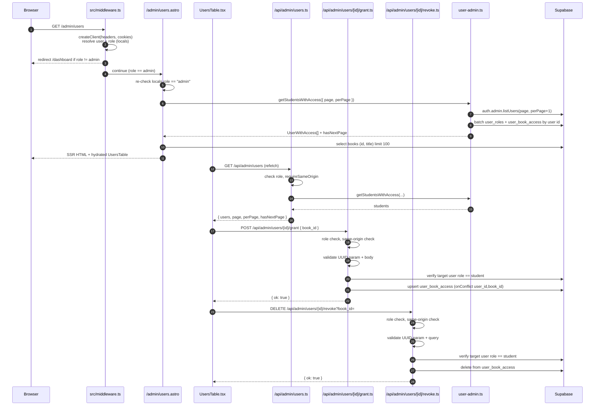

# Research — Admin User & Book-Access Management Flow

> **Target:** `admin-user-access-analysis`  
> **Source:** M4L2 repo-map flagged admin user/book-access as the hottest, highest-risk surface with tight co-change coupling and a prior delete/restore cycle.  
> **Branch:** `module-4`  
> **Date:** 2026-07-01

---

## Feature overview

### What it is

The admin user & book-access management flow lets an admin:

1. Open `/admin/users` and see a paginated list of student accounts.
2. See which books each student already has access to.
3. Grant a new book to a student.
4. Revoke a book from a student.

It is a vertical slice: Astro SSR page → React island → three Astro API routes → a domain service → Supabase Auth + application tables.

### End-to-end trace



### Detailed steps

| Step | File | Lines | What happens |
|------|------|-------|--------------|
| 1 | `src/middleware.ts` | 6-28 | Cookie-backed Supabase client created; session resolved; `user_roles` queried to set `locals.role`. |
| 2 | `src/middleware.ts` | 30-35 | If route is `/admin/*` and role is not `admin`, redirect to `/dashboard`. |
| 3 | `src/pages/admin/users.astro` | 10 | Page re-checks `locals.role !== "admin"` and redirects. |
| 4 | `src/pages/admin/users.astro` | 12-14 | Creates request-scoped Supabase client; parses `page` query param (defaults to 1, rejects non-positive). |
| 5 | `src/pages/admin/users.astro` | 26-30 | Calls `getStudentsWithAccess({ page, perPage: 20 })`. |
| 6 | `src/lib/services/user-admin.ts` | 52-60 | `createAdminClient()` → `auth.admin.listUsers(page, perPage + 1)`. Filters out users without email; slices to `perPage`; computes `hasNextPage`. |
| 7 | `src/lib/services/user-admin.ts` | 72-100 | Chunks user ids by 200; batch-loads `user_roles` and `user_book_access` with `books(id, title)` join. |
| 8 | `src/lib/services/user-admin.ts` | 126-144 | Filters to students, joins book access, sorts by email, returns `UserWithAccess[]`. |
| 9 | `src/pages/admin/users.astro` | 32-42 | Loads `books` catalog (`limit 100`) for the grant dropdown. |
| 10 | `src/pages/admin/users.astro` | 64-80 | Renders `UsersTable` island with server-fetched `users` and `books`; renders pagination links if `hasNextPage`. |
| 11 | `src/components/admin/UsersTable.tsx` | 37-50 | `refetchUsers` calls `GET /api/admin/users` and replaces local rows. |
| 12 | `src/pages/api/admin/users.ts` | 23-35 | Checks `locals.role !== "admin"`, same-origin headers, parses pagination, delegates to `getStudentsWithAccess`. |
| 13 | `src/components/admin/UsersTable.tsx` | 58-136 | `handleGrantBook` validates selection, mutates local `rows` optimistically, `POST`s to `/api/admin/users/{id}/grant`, rolls back on failure, refetches on success. |
| 14 | `src/pages/api/admin/users/[id]/grant.ts` | 31-83 | Role + CSRF checks, UUID/body validation, target-role check, upsert into `user_book_access` with `ignoreDuplicates`. |
| 15 | `src/components/admin/UsersTable.tsx` | 138-191 | `handleRevokeBook` mirrors grant: optimistic removal, `DELETE` to `/api/admin/users/{id}/revoke?book_id=`, rollback on failure. |
| 16 | `src/pages/api/admin/users/[id]/revoke.ts` | 30-81 | Role + CSRF checks, UUID/query validation, target-role check, deletes matching `user_book_access` row. |

### Security & authorization points

| Layer | Check | Location |
|-------|-------|----------|
| Middleware | Session + role resolution; `/admin/*` guard | `src/middleware.ts:12-35` |
| Page | Re-check admin role before rendering | `src/pages/admin/users.astro:10` |
| API list | Admin role + same-origin | `src/pages/api/admin/users.ts:23-26` |
| API grant | Admin role + same-origin + target is student | `src/pages/api/admin/users/[id]/grant.ts:31-70` |
| API revoke | Admin role + same-origin + target is student | `src/pages/api/admin/users/[id]/revoke.ts:30-67` |

### Runtime boundaries not visible in static imports

- `Astro.locals.role` is set by middleware and consumed by every admin page/route.
- `createAdminClient()` in `user-admin.ts` uses `SUPABASE_SERVICE_ROLE_KEY`; it bypasses RLS to read auth users and cross-user access rows.
- Grant/revoke endpoints use `createClient()` (cookie-backed, RLS-aware anon key) but add explicit admin + target-role checks.
- `private.has_book_access()` and `private.has_lesson_access()` are currently overridden by migration `20260629000000_open_book_access_for_students.sql` to return `true` for all users, so grants currently do not gate the student experience.

---

## Technical debt

### 1. E2E-only coverage for a security-critical flow

- **Evidence:** Only Playwright specs cover this flow; `src/lib/services/user-admin.ts` and all three admin API routes have zero unit/API-contract tests.
- **Risk #4 from test-plan:** cross-role/cross-user access is high-impact, low-likelihood, and currently only guarded by E2E happy-path tests.
- **Missing coverage:**
  - Admin role guard on every API endpoint (`users.ts:28`, `grant.ts:30`, `revoke.ts:30`).
  - Same-origin / CSRF guard (`users.ts:7-18`, `grant.ts:17-28`, `revoke.ts:17-28`).
  - Target-user role check (`grant.ts:66-74`, `revoke.ts:59-67`).
  - Invalid UUID / malformed body / missing `book_id` validation paths.
  - DB error handling and 500/503 responses.
  - Empty user list, chunking >200 users, `hasNextPage` edge cases in `user-admin.ts`.

### 2. Triplicated `locals.role === "admin"` guard

- **Evidence:** The same role check appears in middleware, the Astro page, and each API route. The check is not centralized in a single helper.
- **Risk:** Inconsistent updates when adding a new role (e.g., `teacher`) or changing guard logic create authorization holes.

### 3. Duplicated same-origin check across three API files

- **Evidence:** `requireSameOrigin` is copy-pasted in `users.ts`, `grant.ts`, and `revoke.ts`.
- **Risk:** A security fix in one endpoint can be missed in another.

### 4. Duplicated `BookOption` interface + manual fetch cast

- **Evidence:** `BookOption { id, title }` is declared in both `users.astro:8-11` and `UsersTable.tsx:15-18`. `refetchUsers` casts `response.json()` to `{ users?: UserWithAccess[] }` without runtime validation.
- **Risk:** Schema drift between page, component, and API response; runtime mismatches are not caught by TypeScript after the fetch boundary.

### 5. Fragile service-role auth listing

- **Evidence:** `user-admin.ts:55-60` calls `supabaseAdmin.auth.admin.listUsers({ page, perPage: perPage + 1 })`, then filters users without email client-side.
- **Risk:** External SDK shape dependency; email filtering after pagination can produce confusing page sizes; SSO/phone-only users are invisible to admins.

### 6. Temporary RLS override decouples grants from actual access

- **Evidence:** `supabase/migrations/20260629000000_open_book_access_for_students.sql` redefines `private.has_book_access()` and `private.has_lesson_access()` to `select true`.
- **Risk:** Grant/revoke rows are written but not consulted by student reads. Reverting the override will surface any data-quality issues introduced now.

### 7. Hard-coded DB conflict target and table names

- **Evidence:** `grant.ts:72-83` uses `onConflict: "user_id,book_id"`; `grant.ts`/`revoke.ts` hard-code `user_roles` and `user_book_access`.
- **Risk:** Schema renames or constraint changes become runtime errors; no single source of truth for these identifiers.

### 8. Mixed client model (reads bypass RLS, writes rely on explicit checks)

- **Evidence:** `user-admin.ts` uses `createAdminClient()` (service role) for reads; `grant.ts`/`revoke.ts` use `createClient()` (cookie-backed) for writes.
- **Risk:** Authorization intent is split: the list service bypasses RLS entirely, while mutations rely on code-level checks. A mistake in either path can leak or corrupt access data.

### 9. Optimistic UI not tested

- **Evidence:** `UsersTable.tsx` mutates local state before the network request and rolls back on failure (`lines 93-132` and `163-180`).
- **Risk:** Race conditions or incorrect rollback logic are only discoverable through E2E; no component-level tests exist.

### 10. Prior delete/restore churn

- **Evidence:** The entire cluster was deleted in commit `e2884e9` and restored in `f2d8e3c`.
- **Risk:** Rebuild may have reintroduced assumptions from the earlier version; history before `f2d8e3c` should be treated as context, not authority.

---

## ast-grep verification

Selected structural claims from the report were verified with **ast-grep 0.44.0**. Zero matches from ast-grep were cross-checked with plain `grep` to distinguish a real absence from a malformed pattern.

| Claim | ast-grep pattern / grep | Result |
|-------|-------------------------|--------|
| Admin role guard is repeated many times | `locals.role !== "admin"` (`.ts`) + `grep 'Astro\.locals\.role !== "admin"'` (`.astro`) | **Confirmed** — 1 in `src/middleware.ts:37`, 15 in `src/pages/api/admin/**/*.ts`, and 11 admin `.astro` pages (≈ 27 occurrences across 25 files). |
| `requireSameOrigin` is duplicated | `grep 'function requireSameOrigin'` | **Confirmed** — exactly 3 definitions: `src/pages/api/admin/users.ts:7`, `grant.ts:17`, `revoke.ts:17`. |
| `BookOption` interface is duplicated | `interface BookOption { $$$ }` (tsx) | **Confirmed** — `src/components/admin/UsersTable.tsx:15` and `src/pages/admin/users.astro:8`. |
| `auth.admin.listUsers` only in the service | `$X.auth.admin.listUsers($$$)` (ts) | **Confirmed** — single call site: `src/lib/services/user-admin.ts:60`. |
| `createAdminClient()` only in the service | `createAdminClient()` (ts) | **Confirmed** — single call site: `src/lib/services/user-admin.ts:57`. |
| `user_book_access` references | `grep 'user_book_access'` | **Confirmed** — `src/lib/services/user-admin.ts:87`, `src/pages/api/admin/users/[id]/grant.ts:73`, `src/pages/api/admin/users/[id]/revoke.ts:72`, `src/lib/database.types.ts:234`, plus a comment in `src/pages/lessons/[id].astro:27`. |
| Hard-coded `onConflict` target | `grep 'onConflict: "user_id,book_id"'` | **Confirmed** — single site: `src/pages/api/admin/users/[id]/grant.ts:79`. |

### Commands for reproduction

```bash
# role checks in .ts files
npx ast-grep -p 'locals.role !== "admin"' -l ts src
npx ast-grep -p 'context.locals.role !== "admin"' -l ts src

# role checks in .astro pages
grep -R 'Astro\.locals\.role !== "admin"' src/pages/admin

# duplicated same-origin guard
grep -R 'function requireSameOrigin' src

# duplicated BookOption
npx ast-grep -p 'interface BookOption { $$$ }' -l tsx src

# service-role auth listing call site
npx ast-grep -p '$X.auth.admin.listUsers($$$)' -l ts src

# service-role client usage
npx ast-grep -p 'createAdminClient()' -l ts src

# user_book_access references
grep -R 'user_book_access' src

# hard-coded conflict target
grep -R 'onConflict: "user_id,book_id"' src
```

All claims held up; no structural claim needed correction.

## Unknowns

- Are email-less Supabase Auth users (SSO/phone) expected in this product? If yes, the list silently drops them.
- Is the `books limit 100` in `users.astro` sufficient for production? Behavior above 100 books is undefined.
- Do production proxies/CDNs preserve `sec-fetch-site`/`origin` headers required by `requireSameOrigin`?
- Will the RLS override be reverted before or after the MVP? The timing changes the blast radius of any grant/revoke change.
