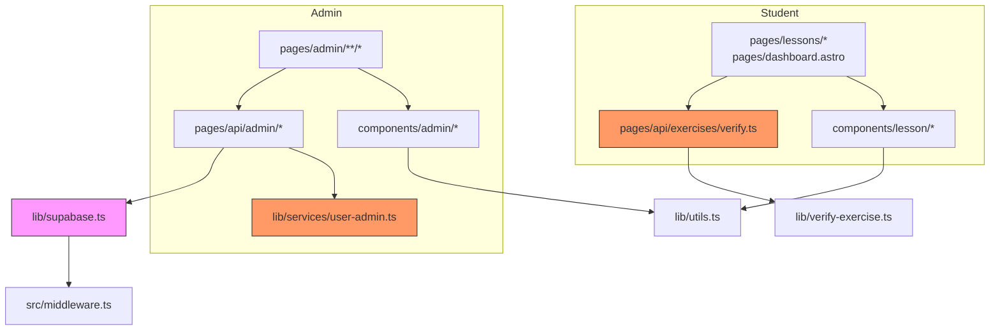

# BET Project Map (`module-4`)

> M4L2 artifact — synthesized from git history, static dependency graph, and contributor context.
> Time window: full repo history `2026-05-23 → 2026-07-01` (134 commits, single author).

## 1. TL;DR

BET is an Astro 6 SSR app for Business English exams. It has two isolated product surfaces: **admin content/user management** and **student lesson consumption**. The dependency graph is a clean DAG with no import cycles; dependencies flow consistently from pages → components/services → `lib/`. The hottest surface is **admin user & book-access management**; the highest correctness risk is the **exercise verification engine**. The biggest structural chokepoints are `src/lib/supabase.ts` (32 fan-in), `src/lib/utils.ts`, and `src/layouts/AdminLayout.astro`. Runtime security depends on `src/middleware.ts` + Supabase RLS policies, which the static graph can point to but not validate.

## 2. Teren — where the work lives

| Area | Role | Depth | Change profile | Why it matters |
|------|------|-------|----------------|----------------|
| **Admin user & book-access mgmt** | Core | Deep | Volatile | Hottest cluster in git history; auth, data authorization, admin UI. |
| **Student lesson consumption** | Core | Deep | Volatile | Main user value; SSR lesson page, exercise island, completion gating. |
| **Exercise verification engine** | Core | Deep | Stable after refactor | Correctness chokepoint between admin answer keys and student progress. |
| **Admin content CRUD** | Supporting / Core | Moderate | Moderate | Books, chapters, lessons, exercises, answer keys. Tight front/back co-change. |
| **Middleware & auth guards** | Supporting | Shallow but cross-cutting | Stable | Role/locals plumbing; small edits ripple to every protected route. |
| **`lib/supabase.ts`, `lib/utils.ts`, layouts** | Supporting | Shallow | Stable | Load-bearing shared infrastructure; maximal blast radius. |
| **`pages/admin/index.astro`, `components/ui/LibBadge.astro`** | Peripheral | Shallow | Static | Orphans in the dependency graph — likely placeholders or unused. |

The whole product was built in a compressed burst at the end of June 2026; July commits are context/archive bookkeeping. That means parallel slices may share implicit assumptions not yet explicit in the code.

## 3. Realne powiązania — actual coupling

- **Direction is consistently outer → inner.** Pages import components, services, and `lib/`; API routes import services and `lib/`; services import `lib/`. No cycles.
- **Admin ↔ student are structurally isolated.** Admin pages/components never import lesson components and vice versa. They share only `lib/supabase.ts`, `lib/utils.ts`, `components/auth/ServerError.tsx`, and layouts.
- **Co-change clusters (not cycles, but dense change propagation):**
  - **User-access star:** `lib/services/user-admin.ts` ←→ `pages/api/admin/users.ts`, `grant.ts`, `revoke.ts`, `pages/admin/users.astro`, `components/admin/UsersTable.tsx`.
  - **Exercise admin star:** `pages/admin/exercises/[id]/edit.astro` ←→ `ExerciseForm.tsx` ←→ `pages/api/admin/exercises/*.ts`.
  - **Lesson renderer fan-out:** `LessonInteractive.tsx` → six exercise-type components.
- **Runtime coupling invisible to the graph:** `middleware.ts` populates `Astro.locals`; RLS policies gate data access; `lib/supabase.ts` reads env vars via `astro:env/server`. These are the real security and correctness boundaries.

## 4. Strefy ryzyka — risk zones

1. **Admin user & book-access management**  
   *Why:* hottest surface, high co-change, touches auth roles and CSRF, and the whole module was deleted then rebuilt once.  
   *Before changing:* read commits `f2d8e3c`, `19074971`, `21f4f63c`, `8b2a68df`.

2. **Exercise verification engine**  
   *Why:* single correctness chokepoint for lesson completion and analytics. A bug here corrupts progress.  
   *Before changing:* read commits `1e33b0c`, `a9a8dbc`, `47f97ddb`; run `npm run test:unit`.

3. **`src/middleware.ts` + `src/lib/supabase.ts`**  
   *Why:* security chokepoints. Every protected route depends on them; env handling and RLS assumptions live here.  
   *Before changing:* read commits `d0b5ff85`, `acf45413`, `4539ac0f`; verify both admin and student route tests pass.

4. **Admin content CRUD (books/chapters/lessons/exercises)**  
   *Why:* rich React-island editors (`ExerciseForm`, `MarkdownEditor`) and their API routes evolve together; changes tend to span front and back end.  
   *Before changing:* read commits `0259e73e`, `2a262df0`, `06800496`, `d5979561`.

5. **Compressed June delivery assumptions**  
   *Why:* 123 of 134 commits landed in June, many in parallel slices. Shared role names, exercise schema shape, and completion state-machine rules may be implicit.  
   *Before changing:* cross-check against `context/foundation/prd.md` and `context/foundation/test-plan.md`.

## 5. Kogo zapytać — who to ask

| Strefa | Kandydat | Uwaga |
|--------|----------|-------|
| All areas | **Piotr Wrotny** | Single author of all 134 commits; all domain knowledge is tacit and concentrated. |
| Admin user/access | Piotr Wrotny | `f2d8e3c` restore + `19074971` impl-review are the authoritative context. |
| Student lesson flow | Piotr Wrotny | `9dd481c5` completion-error fix is the key regression story. |
| Exercise verification | Piotr Wrotny | Refactor into `lib/verify-exercise.ts` (`1e33b0c`) is the current source of truth. |

**Risk:** there is no secondary maintainer. Any future hand-off should prioritize knowledge transfer for middleware, verification, and user-access areas.

## 6. Pierwszy dzień — first files to read

Sorted from broad security/context down to specific business logic:

1. `src/middleware.ts` — how role/locals and route protection work.
2. `src/lib/supabase.ts` — client creation, env usage, admin vs. user client.
3. `src/lib/services/user-admin.ts` — domain service behind admin user access.
4. `src/pages/api/admin/users.ts` + `src/pages/api/admin/users/[id]/grant.ts` + `src/pages/api/admin/users/[id]/revoke.ts` — access-control API surface.
5. `src/lib/verify-exercise.ts` — exercise correctness logic (pure, tested).
6. `src/pages/api/exercises/verify.ts` — HTTP wrapper over verification.
7. `src/pages/lessons/[id].astro` + `src/components/lesson/LessonInteractive.tsx` — student lesson flow and exercise dispatch.
8. `context/foundation/prd.md` + `context/foundation/test-plan.md` — domain requirements and phased test strategy.

## 7. Ograniczenia — what this map does NOT say

- **Time window:** only ~5 weeks of history. Long-term trends, seasonal work, and turnover patterns are invisible.
- **Single author:** 100 % of commits are from Piotr Wrotny. Contributor analysis can only surface *where* he worked, not *who else* knows the code.
- **Static graph gaps:** dependency-cruiser does not parse `.astro` frontmatter natively; the combined graph used a custom frontmatter parser. Runtime coupling (`Astro.locals`, RLS, env vars, feature flags) is not shown.
- **Orphans may be dead or planned:** `pages/admin/index.astro` and `components/ui/LibBadge.astro` have no in-repo dependents. Verify reachability before deleting.
- **No quality assessment:** the map describes shape, activity, and coupling, not whether the code is good, tested, or secure.
